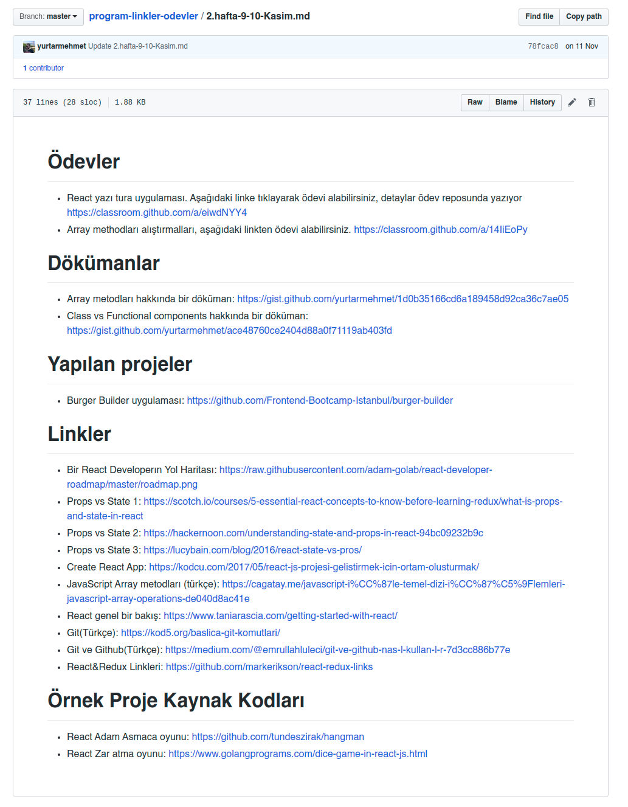
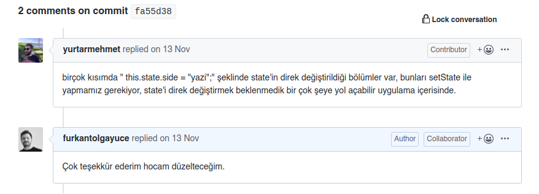

# Kodluyoruz | Code Of Conduct

Bu doküman, Kodluyoruz'un tüm bootcamp'lerinde geçerli olan; Öğrenci - Kodluyoruz, Öğrenci - Eğitmen, Öğrenci - Öğrenci arasında kabul edilmiş kuralları tanımlamaktadır.

## Neden bir Code of Conduct'a İhtiyaç Duyuyoruz?
Bu Davranış Kuralları (Code of Conduct) rahat, huzurlu, korkusuz ve üretken bir topluluk inşaa edebilmemize yardımcı olmak için tasarlanmıştır. Bu Davranış Kurallarının (Code Of Conduct) amacı; topluluğumuza bir takım gereksiz kurallar yüklemek, "kötü" insanlara cezalar uygulamak ya da geçmişte bir takım yanlış yapılmış uygulamaları düzeltmeye çalışmak değildir. Burada yazılmış kurallara uyulmayan ve/veya daha kötü şartlarda çalışmak durumunda kalmış insanlarla bir araya geldiğimizde de yine harika bir topluluk ortaya koyabilmeyi amaçlamaktadır.

## KODLUYORUZ EĞİTMEN REHBERİ

Kodluyoruz Eğitmeni olarak aramıza katıldığın/katılmak üzere olduğun için çok heyecanlıyız, gençlerin geleceğine ve sektöre değer katmaya istekli, bizimle aynı motivasyona sahip ekip arkadaşlarıyla bir araya gelmek bizi çok mutlu ediyor. 

Hem bizi daha yakından tanıman, hem de eğitim sürecinde sana yardımcı olması için hazırladığımız Eğitmen Rehberi’nin içinde “Kodluyoruz Etik Kodu” olarak isimlendirdiğimiz bu davranış kurallarını ve eğitim boyunca yapman gerekenlerin bulunduğu “Yapılacaklar Listesi’ni bulacaksın.

Bu kitapçık, eğitimini en verimli şekilde yürütmek ve katılımcılarla sağlıklı bir iletişim kurabilmek hakkındaki soru işaretlerini gidermek için hazırlandı. Eğitim sürecine dair herhangi bir konuda başka bir soru işaretin olursa sormaktan çekinme!

## KODLUYORUZ ETİK KODU

### 1) Ayrımcılığı reddetmek,

Kodluyoruz, kişilerin rengi, maddi durumu, ırkı, dili-lehçesi, siyasi görüşü, inancı-inançsızlığı, cinsiyeti ve cinsel yönelimi nedeniyle birbirlerini ayrıştırmasını, gruplaşmasını ve bu doğrultuda tavır almasını kesin bir şekilde reddeder. Eğitmen, Kodluyoruz çatısı altında **din** ve **siyaset** başta olmak üzere ayrımcılığı körükleyebilecek her türlü konudan uzak durur, öğrencileri de bu doğrultuda bilgilendirir.

### 2) Ayrımcı ve cinsiyetçi söylemden uzak durmak,

Kodluyoruz, cinsiyet temelli eşitsizliği ortaya koyabilecek mahiyette olan her türlü söyleme ve eyleme kesin bir dille karşıdır. Cinsiyetçiliğe ya da cinsel yönelimlere yönelik yaralayıcı, kırıcı söz söylemeyeceğini kabul eden kişi topluluk içerisindeyken buna her daim dikkat etmekle mükelleftir. Aynı zamanda herhangi bir dili, dini ya da etnik kökeni öven veya eleştiren örnekler vermekten de kaçınmalıdır.

### 3) Bilgi eksikliği için suçlamamak,

Eğitime katılan kimse bir diğeri ile aynı eğitim geçmişine, aynı ilgi düzeyine veya aynı teknik beceriye sahip değil. Bu sebeple Kodluyoruz öğrencileri ve eğitmenleri hiç kimseyi bilmediği bir konu yüzünden yargılamaz ve kırmamaya özen gösterir.

### 4) Soru sormaya çekinmemek,

Kodluyoruz eğitmenleri, öğrencilere soru sorma özgürlüğü ve rahatlığını sağlamakla yükümlüdür. Eğitmenler, öğrencilerin soru sormaktan çekinmeyecekleri bir ortam yaratıldığı takdirde daha fazla gelişim kaydedebileceklerinin bilincinde olmalıdırlar. 

### 5) Öğrencilerin yardımlaşması,

Öğrenciler yardıma ihtiyaç duydukları takdirde eğitim sonrasında yapılan etütte ya da iletişimin sağlandığı kanalda (Telegram) sorularını sorarlar. Bunun yanısıra öğrenciler arkadaşlarının teknik olarak cevap aradığı soruları kendi sorularıymış gibi kabul edip yardımcı olmalıdırlar. Soruyu soranla beraber cevaplayanın da kendini geliştirdiği bir ortam yaratmak eğitmenin görevleri arasındadır.

### 6) Eğitmenlerin bilmediği konular,

Eğitmenler sorulan tüm teknik sorulara tatmin edici cevap vermekle yükümlüdürler. Eğitmenler, cevabını bilmedikleri bir soru ile karşılaştıklarında bu soruyu not alıp, bir sonraki hafta yanıtlamakla görevlidir. 

### 7) Bilene öğretmek değil, bilmeyene öğretmek,

Öğrencilerin her biri aynı ilgi ve bilgi seviyesine sahip olmayacağı gerçeğinden yola çıkılarak; Kodluyoruz eğitmenleri, zaten belli kalıpları öğrenmiş; akranlarına göre bilgili kişileri yetiştirmekle övünmez. Aksine odaklanmakta zorluk çeken, motivasyonunu kaybetmiş ya da kaybetme aşamasına gelmiş gençleri özel olarak eğitir. Zira başarılı öğrenciye işin en iyi yöntemlerini (best practices) vermek yeterlidir. Mesele bırakma noktasına gelmiş gençlere yazılımı sevdirmek ve öğretmektir. Dolayısıyla bu motivasyonla eğitimler gerçekleştirilir.

### 8) Eğitimde verilen bilgiler üzerine araştırma yapılmış, genel bilgiler olmayabilir,

Eğitmenlerin söylediği her şey "genel kabul görmüş" gerçekler olarak algılanmamalıdır. Öğrenciler, eğitmenleri mutlak bir bilgi kaynağı olarak görmemelidirler. Eğitmenler, bilgi aktarırken bu çerçeveye dikkat etmelidir. Bazı noktalarda eğitmenlerin vereceği bilgiler kendi sektör deneyimlerinden elde ettiklerinin birer sonucudur. Bu gibi noktalarda, eğitmen, bu doğruların geneli kapsamayabileceğini; kendi doğruları olduğunu belirtmelidir ve gerekiyorsa öğrencilerle fikir alışverişinde bulunarak tartışabilmelidirler.

### 9) Kodluyoruz eğitmenleri ve öğrencileri bilgi edinmek için yaş ve deneyime bakmaz,

Eğitmenler ile birlikte öğrenciler de kendilerinden yaşça küçük, az deneyimli kişilerden bilgi edinebilirler. Hangi konumda, yaşta olursa olsun katılımcılardan birisi yeni bir güncellemenin bilgisini paylaşıyorsa dinlenerek, üzerine konuşulur ve tartışılır. **Eğitmen, sınıfta geliştirici egosuna (developer ego) yenilmemelidir** ve buna müsait bir ortamın da oluşmasına izin vermemelidir. 

### 10) Anlaşılmayan konular,

Eğitmen anlaşılmayan bir konu olduğunu sezdiğinde önce kendini gözden geçirmeli, mutlaka anlatım tarzını veya örneklerini değiştirmeli ve sınıfına uygun formata çekmelidir. Öğrenciler ise bir konuyu anlamadıklarını düşündüklerinde ilk önce o konu üzerinde yeterince çalışıp çalışmadıklarını sorgulamalıdır. İki tarafın da aksini yapması durumunda eğitim amacından sapacaktır. 

### 11) İletişimin önemi,

Kodluyoruz öğrencileri, ilk dersten itibaren iletişimin iş hayatında ne denli önemli bir yere sahip olduğunun farkında olmalıdırlar. Eğitmenler, eğitim süresi boyunca teknik konularla beraber bu farkındalığı da yaratmak adına anlatımlarını şekillendirirler. 

### 12) Derse odaklanmak; iyi bir defter ve iyi bir kalem,

İyi bir eğitim için olmazsa olmaz olan iki şey; kalem ve defterdir. Eğitmenler ilk derste mutlaka bunun önemini anlatırlar. Bilgisayar üzerinden de not tutulabilir; ancak fiziksel bir defter ile kalemin psikoloji üzerindeki etkisini yadsımamalıyız. Öğrencilerimiz mutlaka ve mutlaka ders içerisinde notlar alır. Anlamadıkları noktaları; ders sırasında bahsedilen anahtar kelimeleri (keywords) daha sonra çalışmak, konu bitiminde eğitmene sormak veya grup arkadaşlarına danışmak için not alır.

### 13) Derse katılım hakkında,

Eğitimde süreklilik en önemli konulardan bir tanesidir. Bu noktada eğitmenler öğrencilere eğitime gelmedikleri her ders, bir başkasının hakkını, hatta geleceğini elinden çaldığını ilk derste aktarmalıdır. **Bir öğrencinin mezun olması için, derslerin en az %80’ine gelmesi ve ödevlerin en az %80’ini tamamlaması zorunludur.**
*“Kodluyoruz öğrencileri bahane üretmez, önceliklerini belirler. Eğer eğitime gelmek gerçekten öncelikleri değilse, gerçekten sadece öncelikleri değildir. Bunun için bahane üretmezler.”* 

### 14) Eğitmenler ve öğrenciler güncelleme notlarını takip ederler,

Eğitmenler ve öğrenciler beraber mutlaka ve mutlaka tüm güncelleme notlarını takip ederler. Çok hızlı değişen ve gelişen bu alanda yenilikleri, güncellemeleri takip etmek eğitimin verimliliği açısından oldukça büyük bir öneme sahiptir. Bu güncelleme notlarının içerisinde; işletim sistemi ve versiyonları, yazılım dili, kullanılan uygulama bileşenleri, kullanılan ide ve pluginleri vs. bulunmaktadır.

### 15) Eğitmenler ve öğrenciler etkinlikleri takip ederler ve ettirirler,

Eğitmenler ve öğrenciler çalıştıkları alanlardaki etkinlikleri Meetup ve benzeri kanallardan sıkı takip ederler. Buralarda harcadıkları vakitleri kayıp olarak görmezler. Yeni gördükleri ve ihtiyacı olacağını düşündükleri tüm etkinliklere katılmak için çabalarlar. Sadece bunu yapmakla kalmaz, diğer arkadaşlarına da bu etkinlikler hakkında bilgi verirler ve katılmaları için motive ederler. Etkinliklerde edindikleri bilgileri arkadaşlarına aktarırlar.

### 16) Eğitmenler ve öğrenciler bol bol KodluyoruzLab, blog ve akademik yazı okurlar, KodluyoruzLab’de yazarlar,

Eğitmenler ve öğrenciler okumanın önemi konusunda hemfikir olmalıdırlar. Eğitmenin ilk derste kendi kaynaklarını ve bu konudaki yöntemlerini öğrencilerle paylaşması, daha önce bu konuda herhangi bir deneyimi olmamış kişiler için faydalı olacaktır. Akademik kaynak okumak, dinlenmek amaçlı dahi yapılan bir eylemdir. Öğrenciler, KodluyoruzLab isminde, Kodluyoruz mezunlarının her hafta blog yazıları yazdığı programa dahil olup yazı yazmalarının kariyerleri için ne kadar önemli olduğunun farkında olmalıdır.

## KODLUYORUZ GITHUB KULLANIMI

### Eğitmenler, derste mutlaka GitHub Classroom kullanmak zorundadır. 

Eğitmen, öğrencilerin GitHub hesapları yoksa **mutlaka** oluşturmalarını sağlamalıdır. (Detaylar için [Gihub Classroom Nedir?](https://medium.com/kodluyoruz/github-classroom-nedir-473a5d371c4f?source=collection_home---2------4-----------------------) yazımıza bakabilirsiniz. Örnek GitHub Classroom kullanımı için: https://github.com/Frontend-Bootcamp-Istanbul)

Github Classroom, GitHub’ın organizasyon yapısına çok benzer bir yapıyı kullanır. GitHub’ın bütün özelliklerinin kullanılabilmesinin yanında sağladığı araçlar ile hem verilen ödevlerin hem de öğrencilerin takibinin yapılabilmesini oldukça kolaylaştırır. Eğitmenlerimizin bootcamp süresince bu altyapıyı kullanmalarının öğrencilerin gelişimi ve GitHub’larının doldurulması için çok önemli olduğunu düşünüyoruz.

### Derslerde nasıl kullanılmalı?

Eğitmen tarafından dersin nasıl anlatılacağı tasarlanırken GitHub Classroom’un sürece dahil edilmesi gerekir. Konular anlatılırken geliştirilen her bir proje için Classroom’da bir repo oluşturulmalıdır. Öğrencilerin derste anlatılan konuları tekrar edebilmeleri için her bir yeni konu veya projeye yeni bir özellik eklendiğinde yapılan değişiklikliğin tanımıyla birlikte commit edilmelidir.

Anlatılan bir konunun hemen ardından öğrencilere sınıf içerisinde küçük ödevler verilmesi hafta sonunda verilen ödevlerin yapılmasını sağlayacağı gibi ilaveten pek çok faydası olacaktır. En büyük faydası sınıftaki herkesin elini kodla kirletmek zorunda kalmasıdır. Küçük ödevler yapılırken alınabilecek hataların bir çoğuyla karşılaşan öğrenciler hem birbirlerine yardım ederek daha çok kaynaşacaklar hem de sık karşılaşılan pek çok hatayı çözdükleri için özgüvenleri artacak ve ödev yapmaya daha motive olacaklardır.

**Örnek senaryo:**
Eğitmen derste döngüleri ve koşulları anlattı, anlaşılması için basit bir proje gerçekleştirdi ve Classroom içerisinde oluşturulmuş repoya yapılan değişikliklerle birlikte gönderdi. Ardından eğitmen gençlere döngü ve koşulları kullanarak yapabilecekleri çok küçük bir ödev (yaklaşık 10-15 dakikalık) vermelidir. Bu ödev, ders süresince geliştirilen projenin bir parçası da olabilir.

### Büyük ödevlerde nasıl kullanılmalı?

Haftalık ders tamamlanırken eğitmen o haftanın ödevini Classroom içerisinde tanımlar. Ödevin ReadMe dosyasında öğrencilere yol gösterecek açıklıkta ödevde ne beklendiği ve yardımcı olabilecek kaynaklar önerilir.

Her öğrenci oluşturulmuş ödev linki vasıtasıyla ödevi üzerine alır ve geliştirmeye başlar. Bütün bu süreçlerin Classroom ile yapılmasıyla eğitmen ödevlerdeki değişiklikleri görebilir ve onlara yorum ekleyebilir. (Klasik GitHub özellikleri).

Her öğrenci yapılan ödev için temel GitHub özelliklerini (pull, commit, push) tekrar tekrar  kullanmak zorunda kaldığından Git özelliklerini pekiştirerek öğrenecektir.
Github Classroom nasıl açılır, ödevler nasıl oluşturulur [buradan](https://classroom.github.com/videos#ChA_zph7aao) bakabilirsiniz.

**KODLUYORUZ EĞİTMENİ VE EĞİTİM ASİSTANI İÇİN YAPILACAKLAR LİSTESİ**
**Bootcamp’in ilk günü yapılacaklar:**
İlk derse 1 saat önceden gidip sınıfın teknik kontrollerinin yapılmasıKatılımcıları, yukarıda dikkat edilmesi belirtilen Kodluyoruz Etik Kodu ile ilgili bilgilendirmek Katılımcıları, ders işleyiş metoduna dair bilgilendirmekYoklama listesinin doldurulması Katılımcıların birbirleriyle yardımlaşabilmesi ve her türlü sorusunu sorabileceği bir iletişim grubu kurulması (Telegram) Toplu fotoğraflar çekilmesiGençlerin, gönderdiğimiz değerlendirme formlarını eğer doldurmadılarsa sadece 5-10 dakikalarını ayırıp doldurmaları. Aynı form eğitim tamamlanınca ve bir süre daha olmak üzere toplam 3 kez doldurulacak (zamanı gelince yeniden göndereceğiz). Amacımız, gençlerin profesyonel gelişimlerini takip etmek. Bu, Kodluyoruz’un etkisini gösterebilmesi ve destek bulup daha çok genci desteklemeye devam edebilmesi için çok kritik.
**Her gün yapılacaklar:**
Yoklama listesi - mutlaka! (Yoklama listesini seninle Drive üzerinden paylaşacağız)Bolca fotoğraf :)Sosyal medyadan Kodluyoruz’u tag’leyerek paylaşımlara teşvik edilmesi Eğitim asistanıyla beraber gerekirse yiyecek içecek konularının organize edilmesiÖdevlerin mutlaka GitHub Classroom üzerinden takip edilmesi
**Bootcamp ortasında yapılacak:**
Kodluyoruz’dan gençlere “2019 Bootcamp Katılımcılarına Yönelik Ara Değerlendirme Formu” gönderilecek. Bunun senin tarafından öğrencilere hatırlatılması önemli.